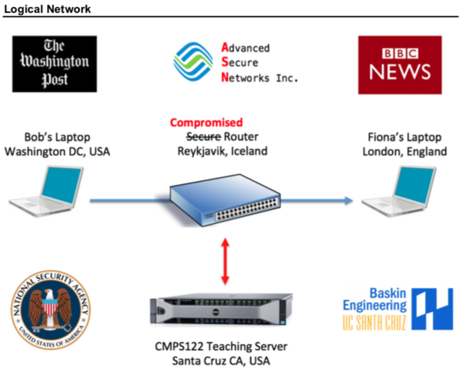

# CMPS 122 Winter 2018 - Computer Security Lab - Fluffygate

As part of my Computer Security class lab at UC Santa Cruz, our task was to extract messages from TCP packets forwarded by a compromised internet router and decipher their contents by intercepting a symmetric cryptography key exchange

## Back Story
Bob is an investigative journalist at the Washington Post and has just learnt from an informant that there’s an illicit trade in endangered Fluffy Unicorns flourishing on Capitol Hill, the kingpins of which operate at the highest levels of government. Concerned that the information he has will be subpoenaed, Bob is making arrangements to send everything to Fiona, a fellow investigative journalist at the BBC in London.
A high bandwidth channel is established via Advanced Secure Networks Inc. at their facility in Reykjavik, Iceland. Fearing interference from domestic security agencies, Bob decides not to trust any of the US based digital certificate issuing authorities and instead opts for a shared key exchange mechanism based on password protected zip files. The passwords for the zip files are exchanged in separate messages using the standard one-way encryption of crypt().

For several weeks, Bob and Fiona practice their key and message exchanges with innocuous content, frequently changing passwords and encryption keys. When they are convinced they have their key exchange mechanism working securely, they start passing the real dirt on “Fluffygate”, changing passwords and keys even more frequently.

Unfortunately for Bob and Fiona, Advanced Secure Networks Inc. is a front for the National Security Agency and the router through which all their messages flow is compromised. The NSA do not want to be seen to be involved in this case of eavesdropping, so have approached the students of CMPS122 for assistance in deciphering the messages Bob will be sending to Fiona.

Once messages start to flow, the NSA will facilitate a live feed from the compromised router. For now, they have provided you with sample packet captures of the type of message they know Bob and Fiona will exchange and encourage you to familiarize yourself with their structure and contents in preparation for the live feed becoming active.

## Mission
### Phase 1
- Crack Bob and Fiona’s passwords
- Use the password to unlock the Zip file and extract an obfuscated key
- Extract the true key from it’s obfuscation
- Use the key to decrypt a series of messages using their matching input vectors
- Unravel PCAP format network packets from supplied test files and extract the plain text from CruzID
specific encrypted messages

### Phase 2
- Decipher the message using the IV and the 128-bit AES key found in the obfuscated Zip file
- Connect to a compromised router and having the network packets forwarded to you. Identical CruzID specific messages will be transmitted only at certain times of day, so some level of automation will be required

### Phase 3
- Passwords and keys change more frequently, the plaintext is subject to an “inner” cipher and CruzID specific messages are transmitted just once at day and change each day

### Phase 4
- With just a 60 minute window to capture and decrypt a series of messages with assorted passwords, keys, and inner ciphers. Sophisticated, rigorously tested, robust automation will be required.

# Technologies Used
- C
- Unix Shell Scripting
- Python Scripting
- Wireshark

